# Untangling Complexity 

Doug Lance
::right::

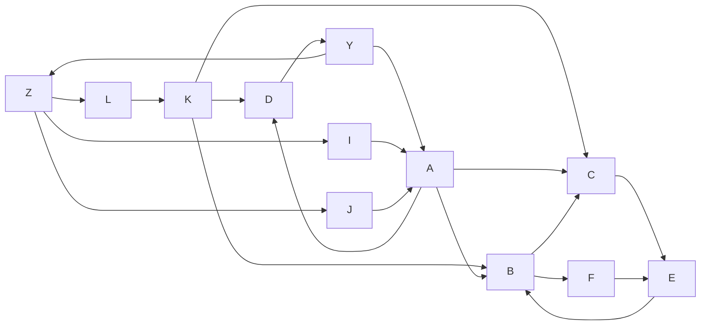

---

## Why?

To make our job easier

<!-- programming is fun. except when it isn't. -->

---

## What's the objective of this talk?

Facilitate a conversation to think about simplicity in a new way

<!-- code that is easy to understand and *easy to change* -->

---

## What are we going to talk about 

- Systems
- Organization
- Practical Applications
- Principles

---

### What is a system? 

a set of interrelated parts that achieves some objective

::right::

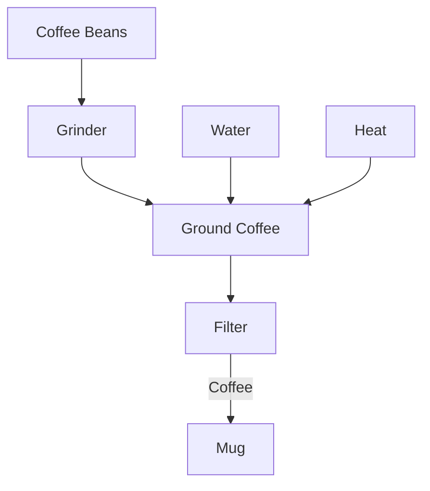

---

### What is complexity? 

- **Simple**: sequential steps

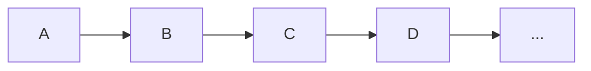

::right::
<div style="margin-top:40px;"/>

- **Complex**: interconnected steps

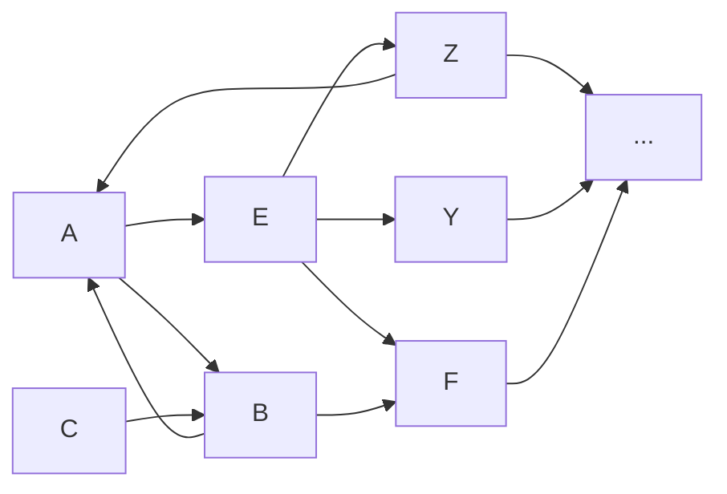
<!-- Our goal is to make simple systems -->
---

### What are the fundamental building blocks of a software system?

<div style="margin-left: 50px; margin-top: 50px;"/>

#### **Functions**

::right:: 

<div style="margin-left: 50px; margin-top: 150px;">
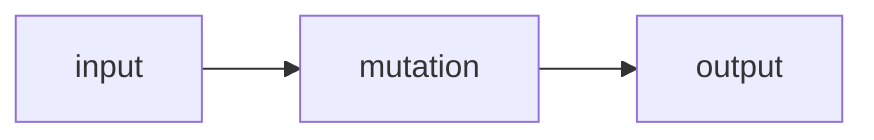
</div>
<!-- 
- it's data transforms all the way down
- data input, change to data, and data output. 
- Turing Machine.
-->

---

## Functions and Pipelines

- **Function**: a single mutation
- **Pipeline**: composition of multiple functions
::right::

```tsx
// function
function doAThing(input: number) {
  return input + 1
}

// function
function doAnotherThing(input: number) {
  return input * 2
}

// pipeline
function doThingsInOrder(input: number) {
  const a = doAThing(input)
  const b = doAnotherThing(a)
  return b
}

```

---

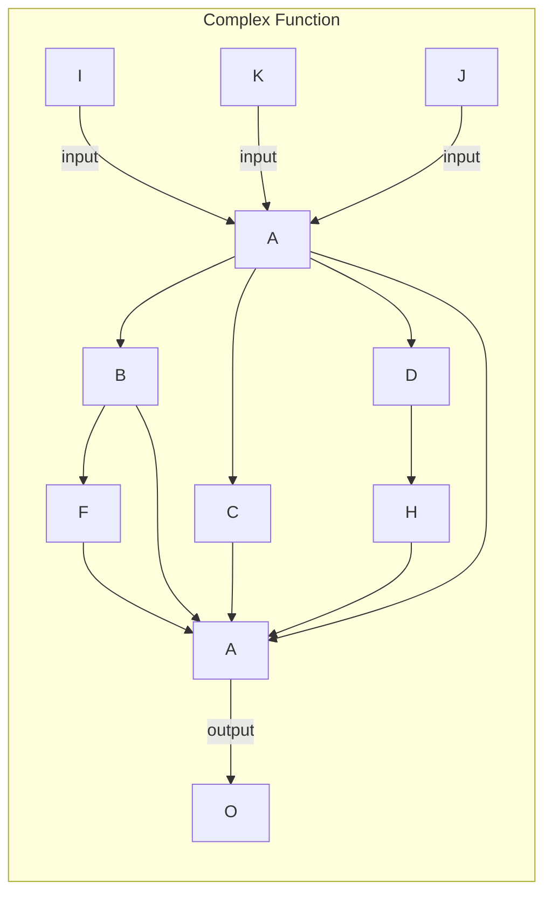

::right::

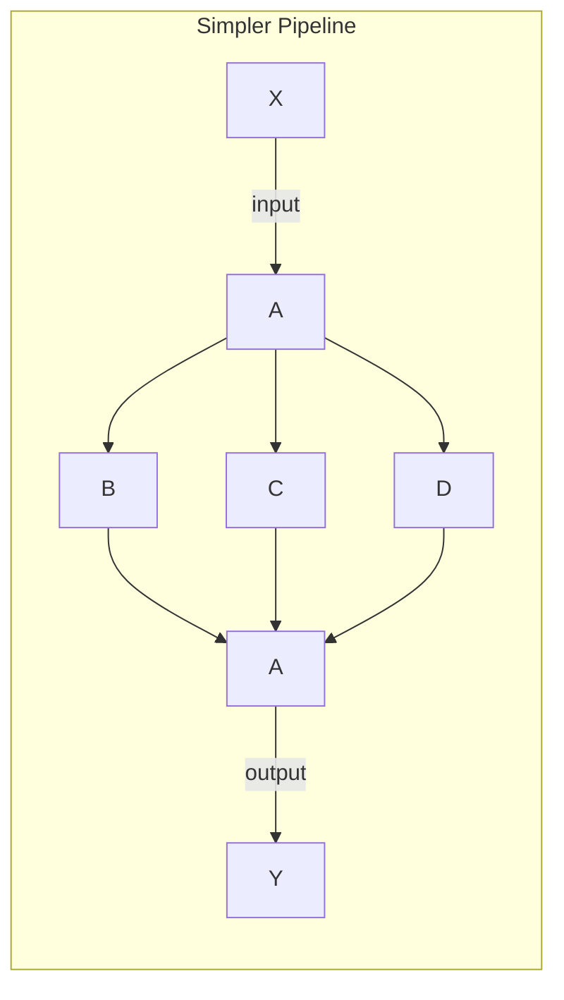

---

### What Are Pure Functions?

- Always return the same output for the same input
- No side effects
  
```tsx
// pure
function sum(a: number, b: number) {
  return a + b
}
```

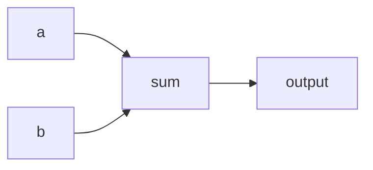

::right::

```tsx
// impure
const [stateVar1, setStateVar1] = useState(0)
const [stateVar2, setStateVar2] = useState(0)

const sum = () => {
  return stateVar1 + stateVar2
}
```

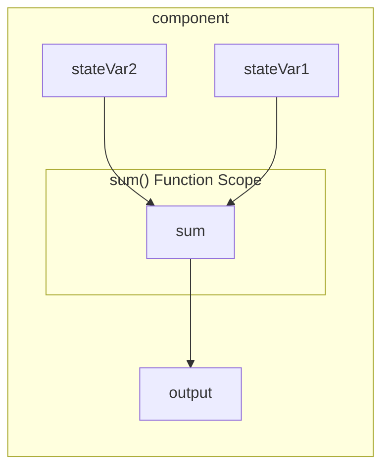

---

### Testing

- Pure functions are easy to test

```tsx
function sum(a: number, b: number) {
  return a + b
}

test('sum', () => {
  expect(sum(1, 2)).toEqual(3)
})
```

- Impure functions are harder to test

```tsx
function sumAndLog(a: number, b: number) {
  const sum = a + b
  console.log(sum)
  return sum
}
test('sumAndLog', () => {
  const mockConsoleLog = jest.spyOn(console, 'log')
  expect(sumAndLog(1, 2)).toEqual(3)
  expect(mockConsoleLog).toHaveBeenCalledWith(3)
})
```

---

### Testing React

- Pure React components are easy to test

```tsx
function MyComponent({ name }: { name: string }) {
  return <div>Hello, {name}</div>
}
test('MyComponent', async () => {
  expect(render(<MyComponent name="World" />)).toMatchSnapshot()
})
```

:: right::

- Impure React components are harder to test

```tsx {all} {maxHeight:'400px'}
function MyComponent({ name }: { name: string }) {
  const [count, setCount] = useState(0);

  const handleClick = async () => {
    setCount((prevCount) => prevCount + 1);
    await writeToDatabase(name, count + 1);
  }

  return <div onClick={handleClick}>Hello, {name}! You have clicked {count} times.</div>;
}

test('MyComponent', async () => {
  const writeToDatabaseMock = jest.spyOn(MyComponent, 'writeToDatabase');
  writeToDatabaseMock.mockImplementation(() => Promise.resolve());

  const { getByText, container } = render(<MyComponent name="World" />)
  const divElement = getByText(/Hello, World! You have clicked 0 times./i);

  fireEvent.click(divElement);
  await new Promise(r => setTimeout(r, 1000));

  expect(container.innerHTML).toMatch('Hello, World! You have clicked 1 times.');
  expect(writeToDatabaseMock).toHaveBeenCalledWith('World', 1);

  writeToDatabaseMock.mockRestore();
})

```

---

### Pure *Pipelines* Are Easy To Test

```tsx
export function toUpperCase(input: string): string {
  return input.toUpperCase();
}

export function removeSpaces(input: string): string {
  return input.replace(/\s+/g, '');
}

export function reverse(input: string): string {
  return input.split('').reverse().join('');
}

export function purePipeline(input: string): string {
  return reverse(removeSpaces(toUpperCase(input)));
}
```

::right::

<div style="height: 72px"/>
<div style="padding-left: 10px">

```tsx {all} {marginLeft:'400px'}
test('toUpperCase', () => {
  expect(toUpperCase('hello world')).toBe('HELLO WORLD');
});

test('removeSpaces', () => {
  expect(removeSpaces('h e l l o')).toBe('hello');
});

test('reverse', () => {
  expect(reverse('hello')).toBe('olleh');
});

test('purePipeline', () => {
  expect(purePipeline('Hello World')).toBe('DLROWOLLEH');
});

```
<!-- That's an integration test -->
</div>

---

### Going too far with pure functions

- Can become a bigger mess
- Can create duplication
- It's **impossible** to avoid:
  - impure functions
  - side effects
  - implicit inputs
  - complexity
- But it can be *encapsulated*
  
::right::

```ts {maxHeight: "800px"}
// dataModule.ts
async function fetchData(url: string) {
    const response = await axios.get(url);
    return response.data;
}

function pipelineData(data: any) {
    // ${insert complex logic here}
    return data.map((item: any) => item * 2);
}

async function saveData(url: string, data: any) {
    const response = await axios.post(url, data);
    return response.data;
}

export function dataModule(url: string) {
    return {
        async getData() {
            const data = await fetchData(url);
            return pipelineData(data);
        },
        async saveData(data: any) {
            return saveData(url, data);
        }
    }
}

```

---

## Encapsulation

- Functions organized into modules are easier to understand
- Try to keep the call site simple by pushing complexity down the stack

:: right::

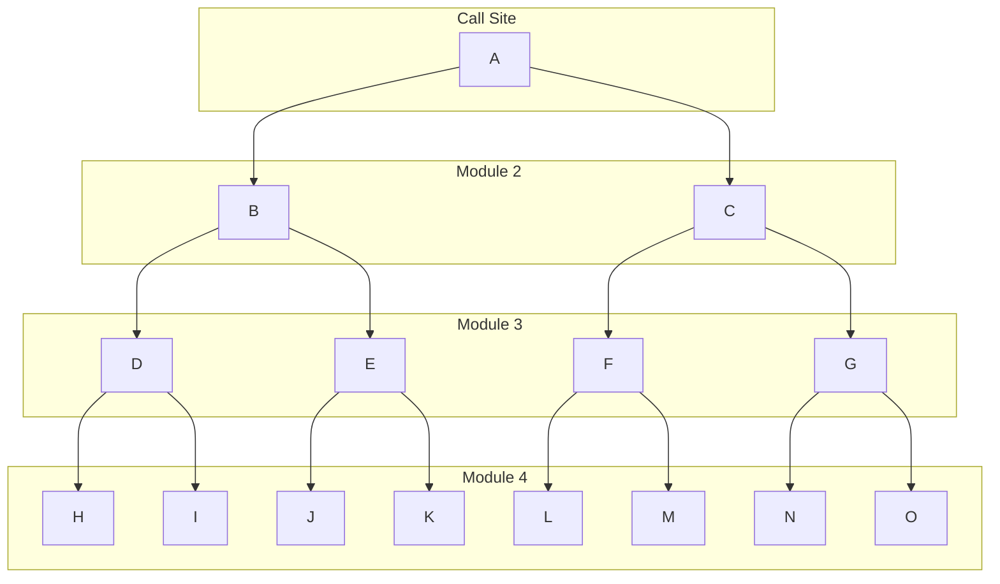

---

### Modules

- Collections of functions that work together *exclusively*

::right::

```ts {maxHeight: "800px"}
// dataModule.ts
async function fetchData(url: string) {
    const response = await axios.get(url);
    return response.data;
}

function processData(data: any) {
    // ${insert complex logic here}
    return data.map((item: any) => item * 2);
}

async function saveData(url: string, data: any) {
    const response = await axios.post(url, data);
    return response.data;
}

export function dataModule(url: string) {
    return {
        async getData() {
            const data = await fetchData(url);
            return processData(data);
        },
        async saveData(data: any) {
            return saveData(url, data);
        }
    }
}

```

---

### Error Handling

- Error handling is easier when you encapsulate your logic into modules
- Handle the lower level errors in the module above
  - **A** handles errors for **Module 2** functions
  - **B** and **C** handles errors for **Module 3** and **Module 4** functions
  
::right::

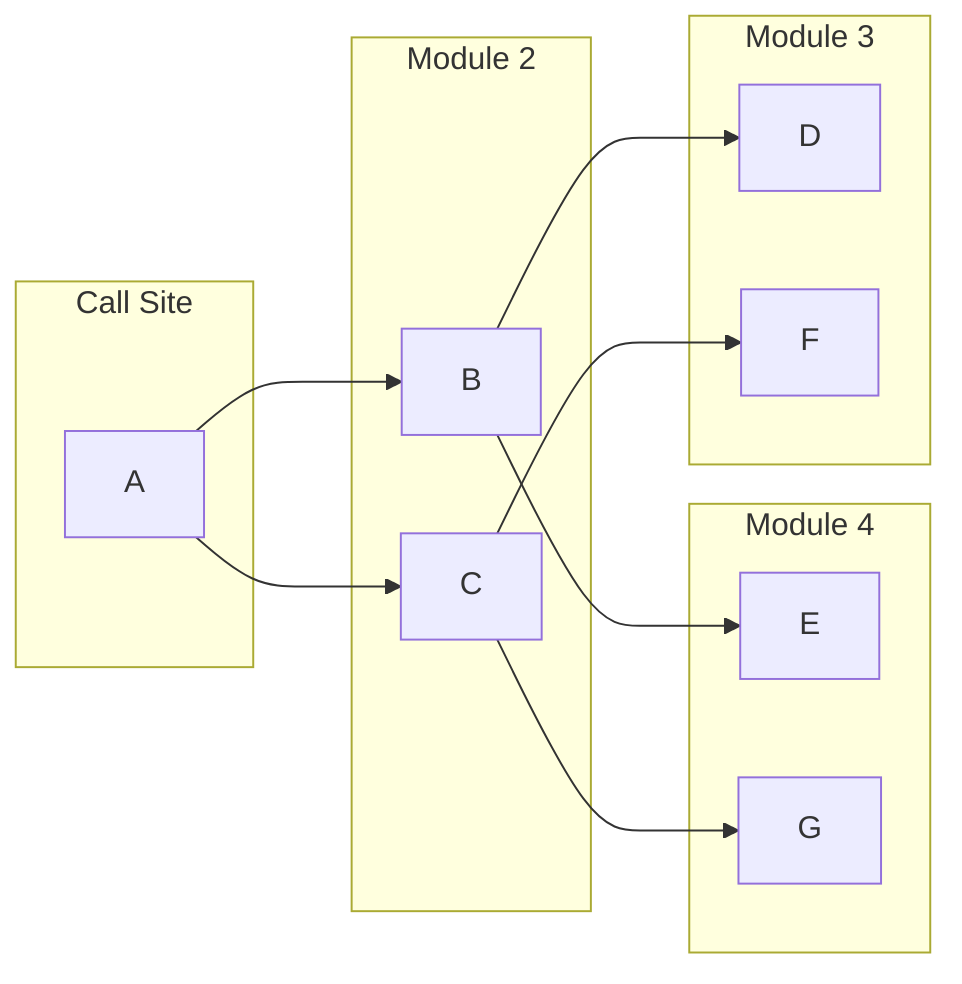

---

```ts
// module4.ts
export const functionE = () => {
  throw new Error('Error from Function E in Module 4');
};

export const functionG = () => {
  throw new Error('Error from Function G in Module 4');
};
```

```ts
// module3.ts
import { functionE, functionG } from './module4';

export const functionD = () => {
  try {
    functionE();
  } catch (error) {
    throw new Error('Error from Function D in Module 3');
  }
};

export const functionF = () => {
  try {
    functionG();
  } catch (error) {
    throw new Error('Error from Function F in Module 3');
  }
};
```

::right::

```ts
// module2.ts
export const functionB = () => {
  try {
    functionD();
  } catch (error) {
    throw new Error('Error from Function B in Module 2');
  }
};
export const functionC = () => {
  try {
    functionF();
  } catch (error) {
    throw new Error('Error from Function C in Module 2');
  }
};
```

```ts
// callSite.ts
export const functionA = () => {
  try {
    functionB();
    functionC();
  } catch (error) {
    console.log('Error handled in Function A:', error);
  }
};
```

---

```ts
// api.ts
export const fetchUserData = (userId: string) => {
  return fetch(`https://api.example.com/users/${userId}`).then(response =>
    response.json()
  );
};
export const fetchUserPosts = (userId: string, postIds: string[]) => {
  return fetch(`https://api.example.com/users/${userId}/posts/`, {
    postIds,
  }).then((response) => response.json());
};
```

```ts
// userService.ts
import { fetchUserData, fetchUserPosts } from './api';

export const getUserData = (userId: string) => {
  return fetchUserData(userId).catch(error => {
    throw new Error(`Failed to fetch user data: ${error.message}`);
  });
};

export const getUserPosts = (userId: string, postIds: string[]) => {
  return fetchUserPosts(userId, postIds).catch(error => {
    throw new Error(`Failed to fetch user posts: ${error.message}`);
  });
};
```

::right::

```ts
// dashboardService.ts
import { getUserData, getUserPosts } from './userService';

export const getDashboardData = (userId: string) => {
  try{
    return getUserData(userId)
      .then(userData => {
        return getUserPosts(userId, userData.postIds)
          .then(userPosts => {
            return { userData, userPosts };
          });
      })
  }
  catch(error){
    throw new Error(`Failed to fetch dashboard data: ${error.message}`);
  };
};
```

```ts
// app.ts
getDashboardData('1')
  .then(data => console.log(data))
  .catch(error => console.error(`Error in app: ${error.message}`));
```

---

## Debugging is easier

- Simple, modular functions are easier to debug

***Examples***

---

## What does this look like in practice?

<!-- Bonus: Callstack is easier to understand -->

---

### Disorganized Function

```ts 
function spaghettiFunction(input1, input2, input3) {
  let x = input1 + input2
  x = x * scopedVar
  let y = input2 - input3
  y = y > 0 ? y : 0
  let z = y % 2 === 0
  return [x, y, z]
}
```

::right::

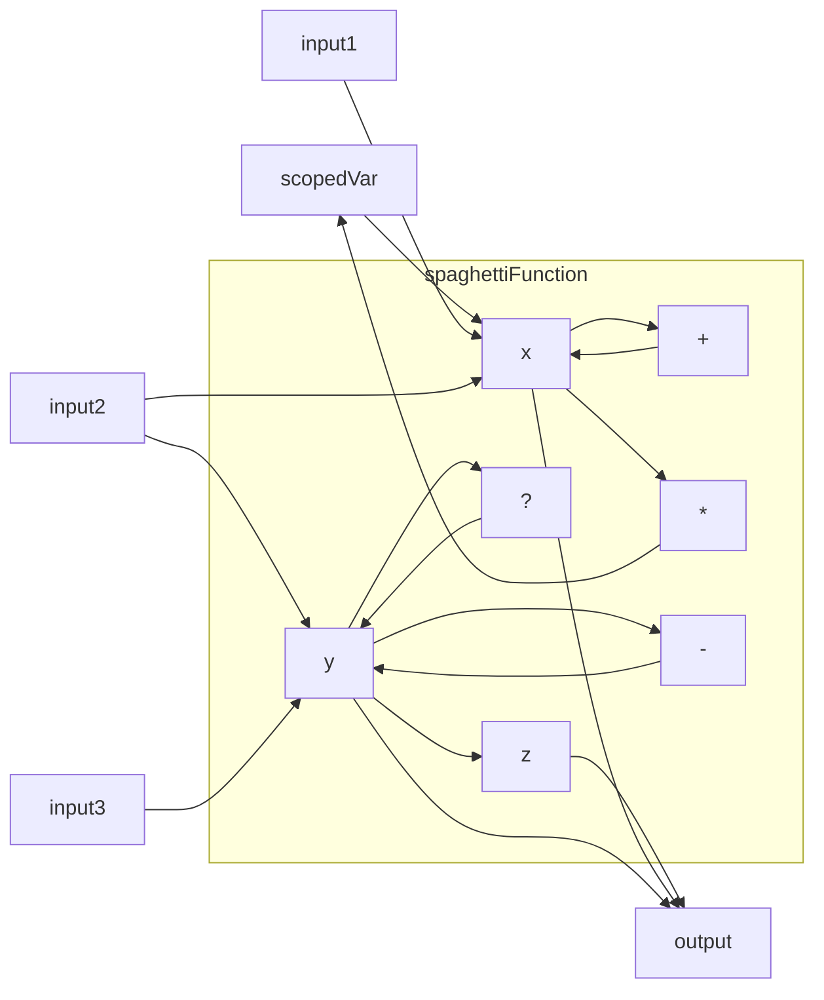

---

### Organized Pipeline

```ts 
type MaintainablePipelineInput = {
  input1: number
  input2: number
  input3: number
  input4: number
}
function sum(a: number, b: number) {
  return a + b
}
function multiply(a: number, b: number) {
 return a * b;
}
function subtractOrZero(a: number, b: number) {
 let difference = a - b;
 return difference > 0 ? difference : 0;
}
function isEven(n: number) {
 return n % 2 === 0;
}
function maintainablePipeline({ input1, input2, input3, input4 }: MaintainablePipelineInput) {
 let x = multiply(sum(input1, input2), input4);
 let y = subtractOrZero(input2, input3);
 let z = isEven(input3);
 return [x, y, z];
}
```

::right::

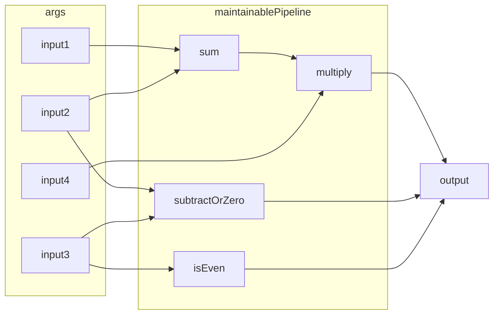
<!-- we're using the type system to validate inputs, mutating state by assigning variables, using syntax to transform into an array for output, then returning that data -->

---

### React

- Components have a single *explicit* input (props)
- **But** imports, hooks, and context are *implicit* inputs
- Everything in scope (other than props) is an *implicit* input
- Hooks can be an *implicit* ***output*** also

::right::

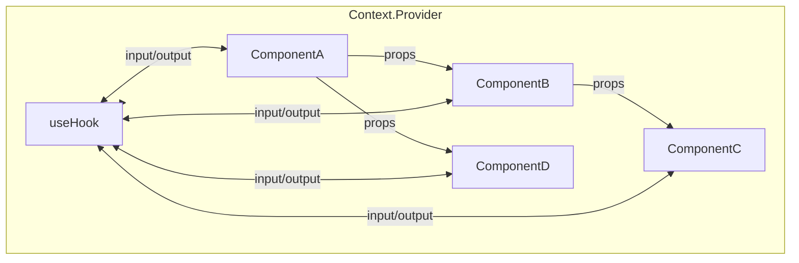

---

### HTML / CSS

```html
<div class="flex-container">
  <div class="flex-item">Item 1</div>
  <div class="flex-item" id="special-item">Item 2</div>
  <div class="flex-item">Item 3</div>
</div>
```

```css
body {
    background-color: lavender;
}
.flex-container {
    display: flex;
    justify-content: space-between;
}
.flex-item {
    border: 2px solid navy;
    padding: 20px;
}
.flex-item:nth-child(2n) {
    background-color: powderblue;
}
#special-item {
    color: white;
    background-color: slategray;
}
```

::right::

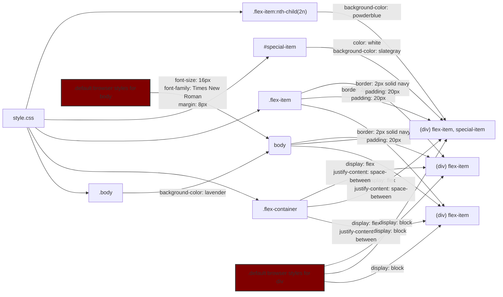

---

### Tailwind

- Fewer implicit inputs
- WYSIWYG
- Less global CSS acting on your elements

```tsx
<div className="flex flex-col w-full h-full">
  <h1 className="font-bold">First Line</p>
  <h3 className="text-slate-500">Second Line</p>
  <p className="hidden">Third Line</p>
</div>
```

:: right::
  
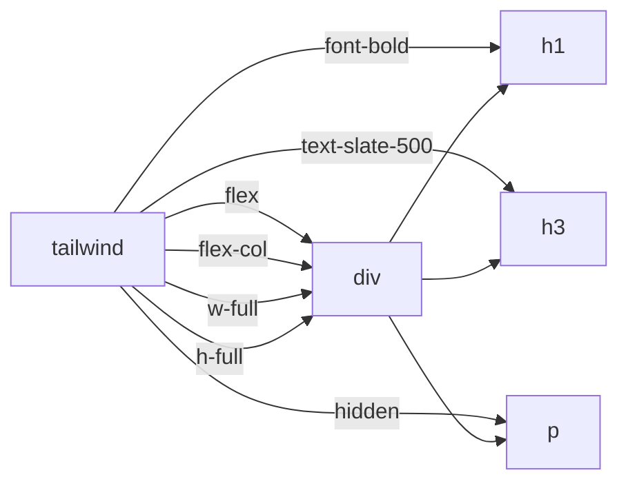

---

## How do we pipeline data

1. Validate input data
1. Mutate the data
1. Transform response for output
1. Output data

::right::

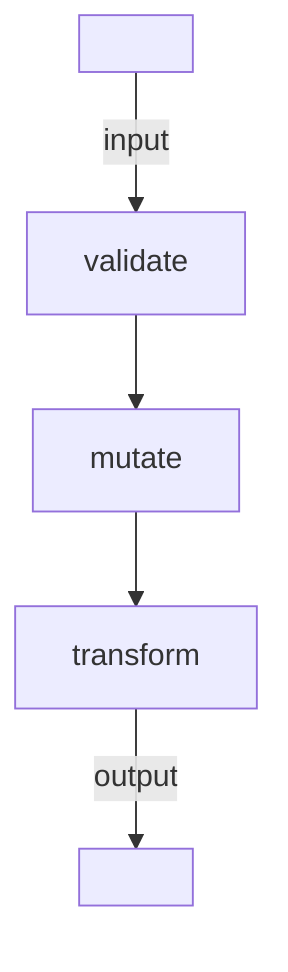

<!-- 
- some of these steps are implied or assumed to have been done outside of a function or using the type system, but they're happening still 
- the platonic ideal of a pipeline is a non-branching pipeline
- each step is a function that takes an input and returns a single output -->
  
---

## Principles

- **Simple** is better than **complex**
- Minimize the number of inputs *(explicit and implicit)*
- Use serial pure functions create pure pipelines
- Encapsulate impure functions in modules
